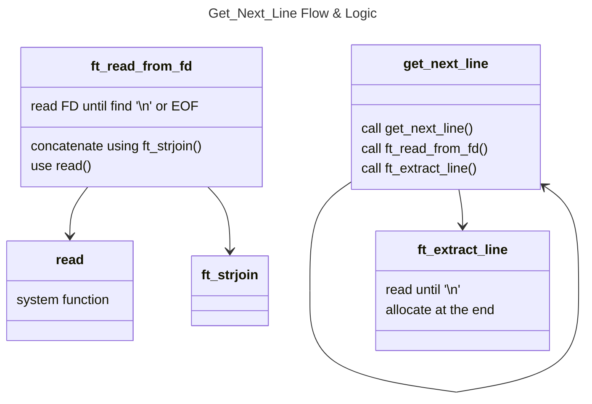

# 🧵 Get_Next_Line: Read Like a Pro. Buffer Like a Beast.

Since the invention of cuneiform writing to the first dot matrix printers, one thing is certain: whoever controls the lines, controls the narrative.  
With get_next_line, you’re not just reading lines — you’re setting the tempo. Every `\n` is my beat.

`get_next_line` is a 42 School project that requires developing a function capable of reading files line by line, preserving context between calls, with efficient memory usage and full compliance with the Norminette (a.k.a. the C secret police).

In practice?

    It’s a function that reads like a Buddhist monk, stores like a paranoid hacker,  
                        and delivers results like a Soviet sniper.

Seriously though: this isn’t just about “reading a line.”  
It’s proving you understand pointers, dynamic memory, reading via file descriptor, and string manipulation without the safety nets of `strdup()` or libc’s `strjoin()`.  
It’s pure C. Raw. No fluff.

## 🧠 What This Beast Does

The `get_next_line` function reads line by line from any file descriptor.  
But saying that is an understatement.

It handles huge files without blinking.  
It never loses info between calls.  
It handles multiple FD's with the calm of someone who’s faced a thousand demons and walked away smiling.

And most importantly:

It respects the user’s time.  
Delivers only what matters — one line at a time, with surgical precision.

## 🕵️‍♂️ Why It’s “Outstanding”

This isn’t just any GNL — it’s the one you want to clone when no one’s watching.

    ✅ Passes all tests (Moulinette, War Machine, and friends).

    ✅ Fully Norminette-compliant and zero memory leaks (Valgrind + ASAN tested hard).

    ✅ Modular and elegant: functions with names your advisor secretly envies (ft_strchr_gnl, ft_strlen_gnl, etc.).

    ✅ Sophisticated memory management: only what’s essential, no unnecessary malloc/free calls.

    ✅ Dedicated buffer for each FD (static array or dynamic linked list — take your pick).

    ✅ Edge cases handled with care: BUFFER_SIZE ≤ 0, invalid FDs, files with only \n, FD switching, and more.

## 🧪 Brilliant Tests I Cooked Up

    ✅ Terminal Maze Game — every line is a command, every command is a door.

    ✅ FD Chaos — open 5 files and call GNL in random order.

    ✅ Buffer Torture — BUFFER_SIZE = 1, BUFFER_SIZE = 999999. Break it if you can.

    ✅ Ur-an-onb — GNL vs /dev/urandom: robustness at stratospheric levels.

    ✅ Differ Power — visual diff against cat + diff, showing mismatches like a hacker boss.

## 📝 Repository Structure

    get_next_line/
    ├── get_next_line.c         # Magic of Entrypoint
    ├── get_next_line_utils.c   # Elute tools
    ├── get_next_line.h         # System Metadata
    └── test/                   # Automatic and Manual tests
        ├── benchmark.sh
        ├── chaos_fd_test.c
    └── README.md

## 📚 High-Tech Glossary

    BUFFER_SIZE: number of bytes read per read() call

    static buffers[OPEN_MAX]: I store data per FD like a sultan controls his domains

    ft_strchr_gnl, ft_strdup_gnl, ft_strjoin_gnl: optimized utilities crafted for GNL

    Reading flow: read() → append to buffer → split into line/node → return
    
## 🌍 Visions or Impacts of Get_Next_Line — This code define Masters

`get_next_line` isn’t just a school exercise or a 42 School challenge. It’s the gateway to true mastery of real-time data control. While most see only lines of text, you’ll master the art of capturing, storing, and delivering information just right — all at the edge of efficiency and elegance.

Every byte you read, every piece of string you manipulate, is a step toward becoming an engineer who understands the internal flow of the OS and how to transform raw, chaotic data into clean, usable information.

Building your own get_next_line is like sharpening a sword for the coding battlefield: you’re not just reading lines — you’re orchestrating data flow, shaping communication between hardware, system, and application. It’s the foundation for every developer who refuses to be mediocre and aims to be the master of input/output.

If `printf` is the “speak” verb of code, `get_next_line` is the “listen” verb — and whoever masters both, owns the entire conversation.

## 🎯 Next Steps

Because stopping here would be… `mediocre`.

    🎥 Cinematic video tutorial (call me Nolan)

    📄 GitHub Pages documentation that looks like a startup landing page

    🤝 Collabs with devs who love code and chaos

  

