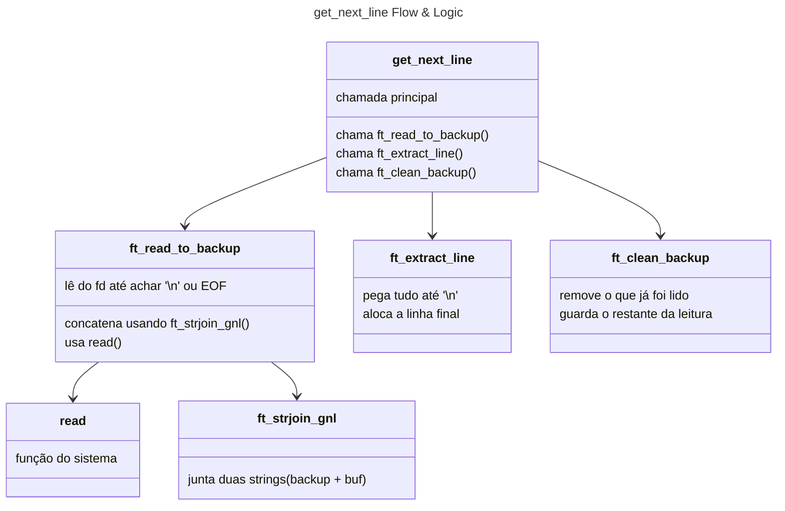

# Get_Next_Line

## Objectivos

1) Ler uma linha por vez de um FD
2) Manter estado entre chamada
3) Encontar o \n retorna linha
4) manter o restante na proxima chamada

```mermaid
---
title: get_next_line Flow & Logic
---
classDiagram
    class get_next_line
    get_next_line : chamada principal
    get_next_line : chama ft_read_to_backup()
    get_next_line : chama ft_extract_line()
    get_next_line : chama ft_clean_backup()

    class ft_read_to_backup
    ft_read_to_backup : lê do fd até achar '\n' ou EOF
    ft_read_to_backup : concatena usando ft_strjoin_gnl()
    ft_read_to_backup : usa read()

    class ft_extract_line
    ft_extract_line : pega tudo até '\n'
    ft_extract_line : aloca a linha final

    class ft_clean_backup
    ft_clean_backup : remove o que já foi lido
    ft_clean_backup : guarda o restante da leitura

    class ft_strjoin_gnl
    ft_strjoin_gnl : junta duas strings (backup + buf)

    class read
    read : função do sistema

    get_next_line --> ft_read_to_backup
    get_next_line --> ft_extract_line
    get_next_line --> ft_clean_backup
    ft_read_to_backup --> read
    ft_read_to_backup --> ft_strjoin_gnl

```

